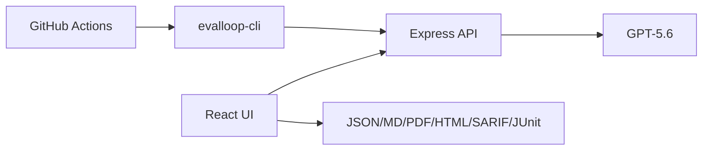

# EvalLoop Architecture

EvalLoop uses a batched evaluation path for core test runs, dedicated security and chain-testing endpoints for advanced analysis, and export formats that fit CI/CD systems.
